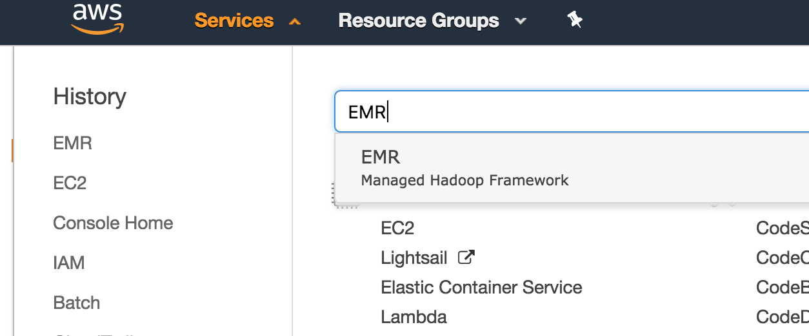
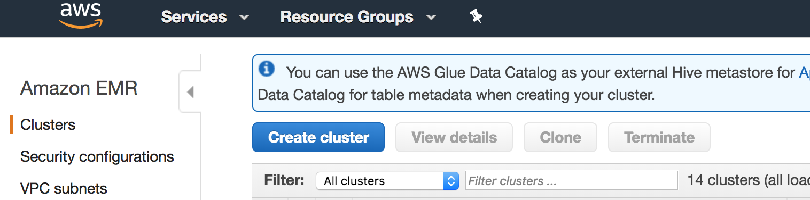
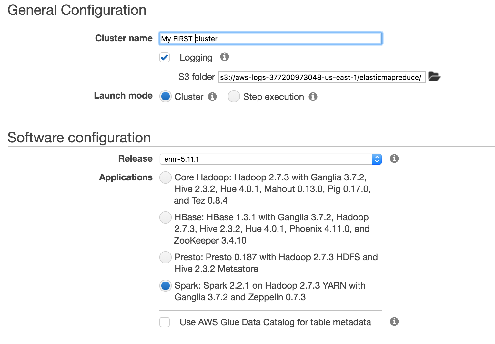
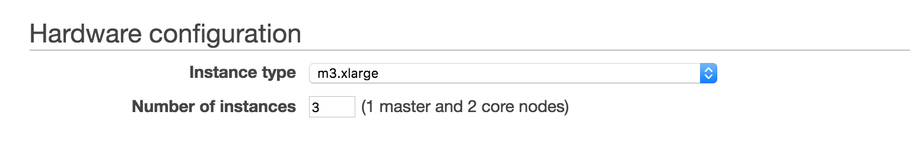
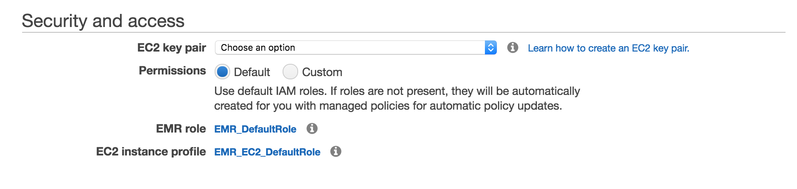
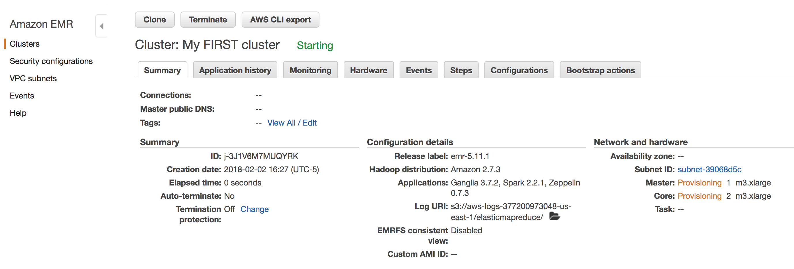

## Apache Spark in a few words

[Apache Spark](https://spark.apache.org/) is a software and data science platform that is purpose-built for large- to massive-scale data processing. Spark supports processing of data in batch mode (run as a pipeline) or in interactive mode using command-line programming style or in popular notebook style of coding. While [scala](http://www.scala-lang.org/) is the native language for Spark, language bindings exist for python, R, and Java as well.

Spark is built around an underlying data abstraction called Resilient Distributed Dataset, or RDD. The RDD represents an immutable, distributed, and partitioned collection of elements that can be operated on in parallel. The collection of elements in the RDD need not fit into memory, though the performance is maximal when the RDD fits into the Spark “cluster” memory.

Spark is capable of processing data [at very large scales](https://spark.apache.org/faq.html). That said, code for Spark need not be written on a large cluster. Spark can be deployed on a laptop as well, facilitating code development and testing at a small scale.

I am not going to delve into working with Spark just yet. Rather, I am starting with a quick walkthrough of creating a Spark cluster on the Amazon Web Services Elastic Map Reduce service [AWS EMR](https://aws.amazon.com/emr/). This is not a recommendation of AWS over other potential providers and choices in the following workflow are *not* meant as best practices. This is just a documentation of the process with a little text.

**Note:** This blog post creates resources on a commercial cloud which will continue to cost money until they are terminated. In order to keep from getting charged for unused resources, be sure to clean up by terminating the resources once you are done.

## Prerequisites

- The main prerequisite is an AWS account.

## Objectives

- Walk through creating an Apache Spark cluster on AWS using the EMR service.

## Let’s go

Login to your AWS [console](https://console.aws.amazon.com).

After logging in, you should see a window with a lot of AWS services listed. At the top left, choose the “Services” button and type “EMR” into the search box. Then, choose EMR.

On the next screen, choose “Create Cluster” by clicking the blue button. Just a note that the “AWS Glue Catalog” that is featured prominently in a couple of places in the configuration is a separatemarkdow service from AWS, [detailed here](https://docs.aws.amazon.com/glue/latest/dg/populate-data-catalog.html).

On this screen, choose an arbitrary name for your cluster. You can choose no logging for now, or specify a logging s3 bucket/path if you like. Change the software configuration to Spark as shown (version numbers may differ–that is OK).

The next step is to configure the hardware that will comprise the cluster. Choosing the appropriate size and number of machines while balancing costs is an art form that I have not mastered. However, you will likely want at least a master and one worker (specify 2 or more). Starting with the defaults for “experimentation” is probably not bad. Roughly speaking, you’ll want enough memory on your cluster to support keeping your datasets in memory for maximum performance.

Unlike many commercially-offered online services, AWS EMR is not, by default, configured for “open” access. To gain access to the cluster, you will need to provide an SSH key [see her for how to generate an ssh key on AWS](https://docs.aws.amazon.com/AWSEC2/latest/UserGuide/ec2-key-pairs.html#having-ec2-create-your-key-pair) that you will later use to enable access to the Spark notebook and web-based user interface for monitoring. Assuming that you have an SSH key created, choose that key in the dropdown as pictured below.

Click the “Create Cluster” at the bottom right of the screen. You should then be presented with a page that shows the cluster details.

On AWS, cluster creation takes several minutes to up to 30 minutes. My only other experience with cloud Spark-as-a-service is on Google Cloud Platform which has a much faster startup time.

After a few minutes, you will have a running Apache Spark cluster that you can begin to experiment with. That will need to wait for another post, but to gain access to the cluster, including a Zeppelin notebook (quite similar to Jupyter), click the “Enable Web Connection” and follow the instructions (a little involved, including establishing a proxy connection and installing a proxy plugin for your browser).

## Cleanup: VERY IMPORTANT

After you have created the Spark cluster, it **costs money** until you destroy it. *Please do not forget* to click “Terminate” and then check back to *make doubly sure* that the cluster is terminated.
