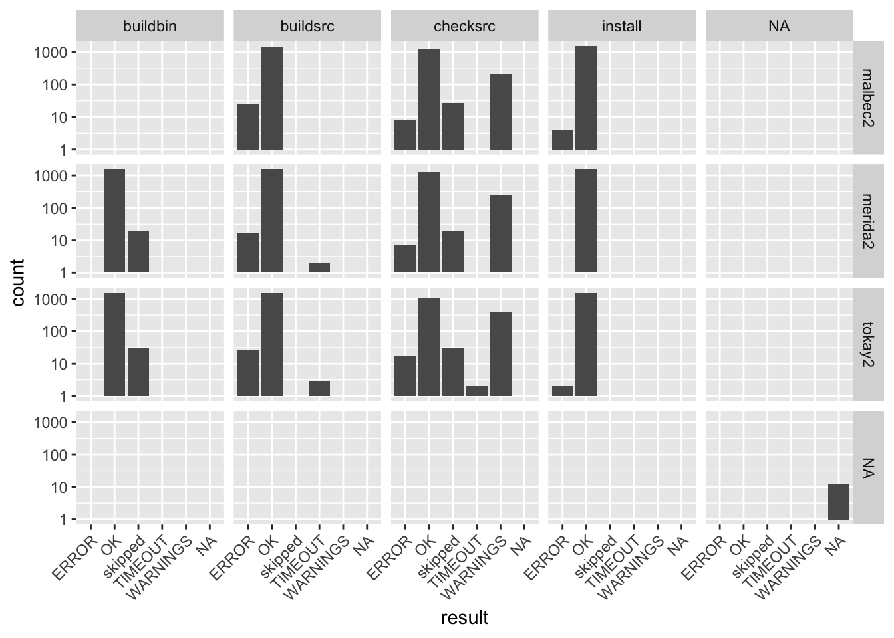

This page exists to check article layout. Paragraphs keep the normal reading measure however wide the artifacts around them get. See [](#fig-narrow), [](#fig-wide), and [](#tbl-wide) below; they are numbered in document order and resolve to links.

## Figures

An ordinary captioned figure uses the intermediate measure:



Figure: A normal figure. The caption is authored separately from the alt text and may carry *Markdown*. {#fig-narrow}

A figure marked wide spans the page. Markdown can't carry a class, so the figure goes in a `div`:

<div class="wide">


Figure: A wide figure, centered on the article. {#fig-wide}

</div>

An image with no caption renders as it always has:


## Tables

A wide data table scrolls inside its own box rather than forcing the page to scroll:

<div class="wide">

| Package | Downloads | Distinct IPs | Maintainer | Repository | Last release | Notes | Licence |
|---|---|---|---|---|---|---|---|
| GEOquery | 314,396 | 112,736 | Sean Davis | Bioconductor | 2025-10-30 | Core GEO access | MIT |
| SRAdb | 12,345 | 4,321 | Sean Davis | Bioconductor | 2025-04-24 | Metadata for SRA | Artistic-2.0 |
| GenomicDataCommons | 23,456 | 7,654 | Sean Davis | Bioconductor | 2025-10-30 | NCI GDC client | Artistic-2.0 |

Table: Per-package usage. Column widths follow content. {#tbl-wide}

</div>

## Code

A long line of code takes the intermediate measure and scrolls if it must:

```python
def summarize(downloads: dict[str, int], year: int = 2025, minimum: int = 1000) -> list[tuple[str, int]]:
    return sorted(((name, n) for name, n in downloads.items() if n >= minimum), key=lambda kv: -kv[1])
```

## Contents

Four or more second-level sections produce the inline contents list at the top of the article, linking to the existing heading IDs.
