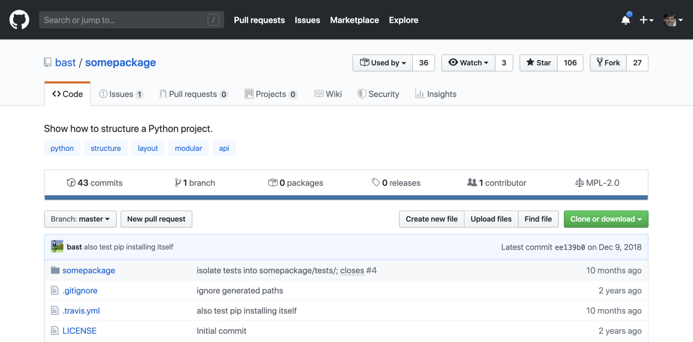
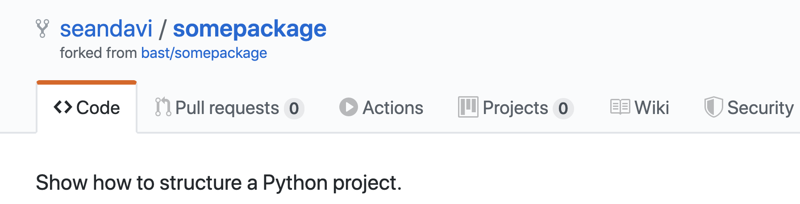
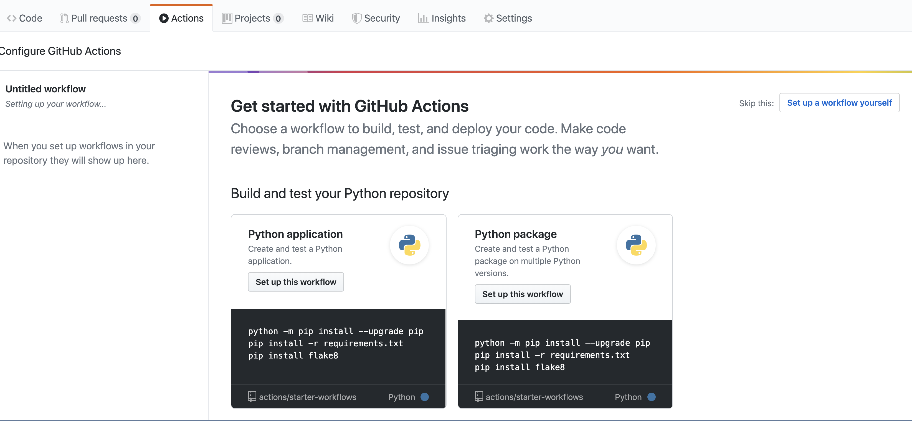
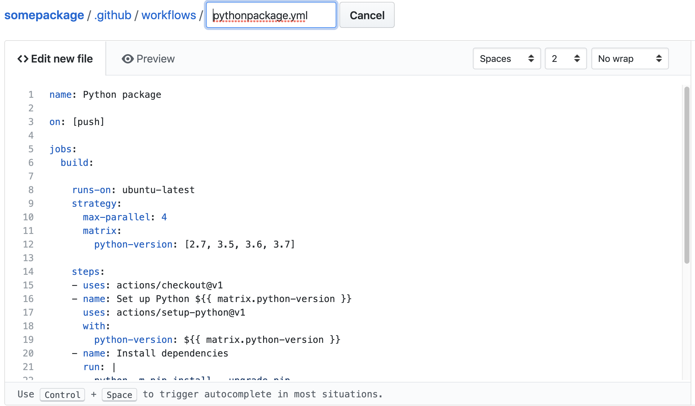
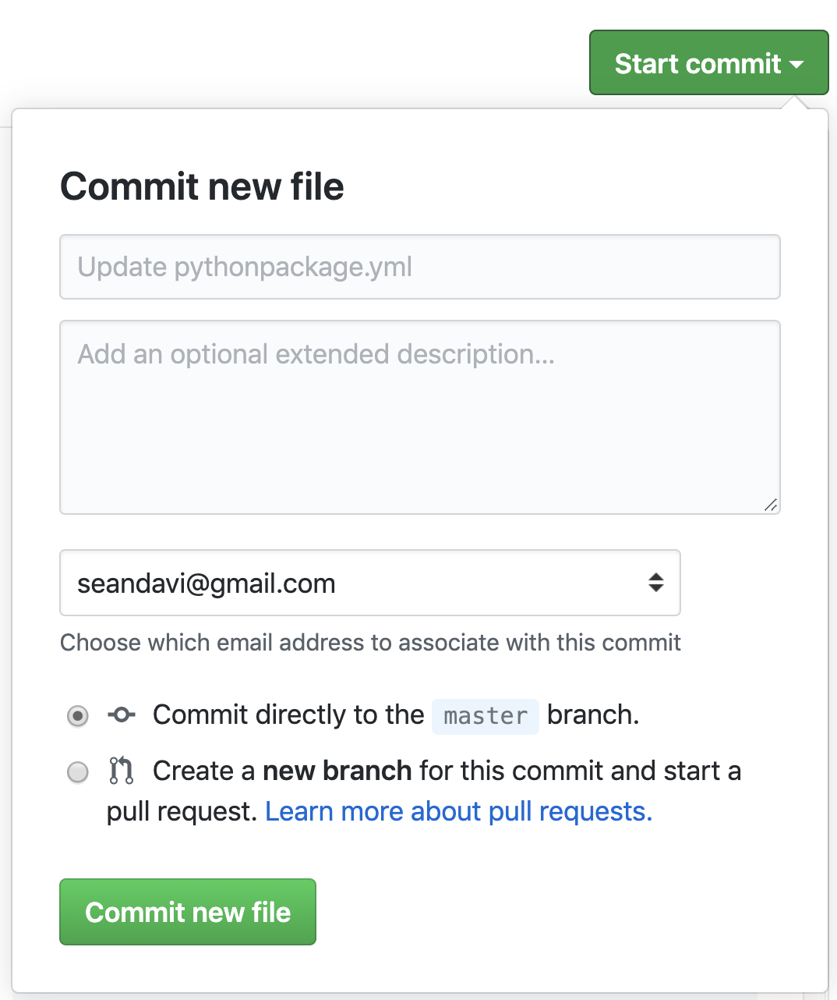

[GitHub Actions] allow flexible and potentially complicated actions
that comprise workflows that respond to [repository events] on Github. Continuous
integration, messaging Slack, greeting new contributors, deploying
applications, and many other templates are ready for customization and
integration into any repo.

As of this writing, GitHub Actions are available as a _beta_ feature,
requiring [signup]. 

## [Definitions](https://help.github.com/en/articles/about-github-actions#core-concepts-for-github-actions)

### Action

An action is the smallest portable building block of a
  workflow. Actions are combined as steps to form a workflow. Actions can be
  created from scratch, modified from [publicly available actions], and
  shared with others. 

### Workflow

 A workflow is a collection of steps (actions) that describe a process
  that will execute in response to GitHub [repository events]. A YAML
  file that defines your workflow configuration with at least one
  job. This file lives in the root of your GitHub repository in the
  `.github/workflows` directory. Multiple workflow files may exist and
  all will be active.
  
  
### Step

A step is a set of tasks performed by a job. Each step in a job
executes in the same virtual environment, allowing the actions in that
job to share information using the filesystem. Steps can run commands
(shell commands, etc.) or actions.

### Virtual environment

GitHub has hosts for Linux, macOS, and Windows that can serve as
execution environments for workflows.

### Runner

Jobs run on a service that waits in virtual environment that waits for available
jobs. The runner takes jobs one-at-a-time and runs each, reporting
logs, etc., back to Github.

### Event 

Workflows can be triggered by a [repository event] such as a push, a
new issue, etc. 

### Artifact

Artifacts are the files that are created during a workflow. These can
be deployed, used in other workflows, published, etc. Additional
actions allow working with artifacts. 

## Walkthrough

### Create repo

Here, I simulate creating a simple python package by forking [this
example repo](https://github.com/bast/somepackage) by
[bast](https://github.com/bast). The package is to exemplify some best
practices for structuring python code. However, here it serves as a
simple example of a formal python package that we can build and test.

Login to Github, navigate to the [example repo](https://github.com/bast/somepackage), and [fork the
repo](https://help.github.com/en/articles/fork-a-repo).



*Fork the [example repo](https://github.com/bast/somepackage).*

After forking, a fresh package will be available in your repository. 

### Add a github action

After ensuring that you have [signed up] for Github Actions and have
verified that you are "in" by noticing the `Actions` button at the top
of your github repository:



*The Github Actions button should be present in order to proceed.*

Now, we can proceed with adding a workflow from the set of recommended
workflow templates (or others). Clicking on the `Actions` button will
bring up the following screen.



*Choose the python package workflow.*

Click on the `Set up this workflow` on the "Python package"
card. That will bring up the following screen.



*The workflow editor.*

What is happening at this point is that Github is about to add a new
file to your repository. The file will be located at
`somepackage/.github/workflows`. Edit the filename as you see
fit. 

The contents of the workflow file will look like the listing below by
default and follows [the workflow
syntax](https://help.github.com/en/articles/workflow-syntax-for-github-actions). 

```python
name: Python package

on: [push]

jobs:
  build:

    runs-on: ubuntu-latest
    strategy:
      max-parallel: 4
      matrix:
        python-version: [2.7, 3.5, 3.6, 3.7]

    steps:
    - uses: actions/checkout@v1
    - name: Set up Python ${{ matrix.python-version }}
      uses: actions/setup-python@v1
      with:
        python-version: ${{ matrix.python-version }}
    - name: Install dependencies
      run: |
        python -m pip install --upgrade pip
        pip install -r requirements.txt
    - name: Lint with flake8
      run: |
        pip install flake8
        # stop the build if there are Python syntax errors or undefined names
        flake8 . --count --select=E9,F63,F7,F82 --show-source --statistics
        # exit-zero treats all errors as warnings. The GitHub editor is 127 chars wide
        flake8 . --count --exit-zero --max-complexity=10 --max-line-length=127 --statistics
    - name: Test with pytest
      run: |
        pip install pytest
        pytest
```

### Commit new workflow file

Once you have made any edits (no need to, though), go ahead and click
the `Start Commit` button.



*Make the first commit.*

### Build results

By navigating back to `Actions`, you should see that the workflow is
running or has already completed. An example of what a running
workflow might look like is below. 


*Image Credit: [GitHub Blog](https://github.blog/2019-08-08-github-actions-now-supports-ci-cd/)*

You are free to investigate the logs, etc. 

### Modifying the workflow

Modifying the workflow is as simple as making edits to the
`.github/workflows/...yaml` file. For example, you might consider
changing the name of the workflow and modifying the python versions
that are used for testing.

### Workflow status badge

Follow [these
instructions](https://help.github.com/en/articles/configuring-a-workflow#adding-a-workflow-status-badge-to-your-repository)
to add a status badge to your repo that will be updated with each
workflow execution. Example code is here:
```
[](https://github.com/seandavi/somepackage/actions)
```

Note the `%20` that represents a url-encoded `space` character. The resulting badge looks like this:

[](https://github.com/seandavi/somepackage/actions)

## Conclusion

Github actions and workflows add continuous integration and other
capabilities that are configurable via text files that are captured
and versioned alongside code. Therefore, actions can be shared,
modified, and manipulated with standard text editors, etc. 

Many actions are [publicly
available](https://github.com/actions). Example workflows are also
[easy to find](https://github.com/actions/starter-workflows). For
those who are partial to *R*, there is the R-centric
[ghactions](https://r-lib.github.io/ghactions/) package that 1)
provides workflow templates for common R projects (packages,
RMarkdown, …) with sensible defaults and 2) wraps and curates relevant
existing external actions, such as those to deploy to GitHub Pages or
Netlify. 

Hardware available as of this writing is [described
here](https://help.github.com/en/articles/virtual-environments-for-github-actions#supported-virtual-environments-and-hardware-resources)
and includes Windows, Linux, and MacOS environments. When a workflow
is running, multiple [environment
variables](https://help.github.com/en/articles/virtual-environments-for-github-actions#environment-variables)
are set and accessible to software. Github actions allow the user to
create
[secrets](https://help.github.com/en/articles/virtual-environments-for-github-actions#creating-and-using-secrets-encrypted-variables)
to securely store credentials for use inside run environments. Github
actions are container-ready, allowing [containerized
actions](https://help.github.com/en/articles/creating-a-docker-container-action). 

This post, like many of my posts, is very operational, but I have
found that a worked example is usually more valuable than long
expository posts. That said, I always appreciate comments and
suggestions for improvements (see below). 

## References

- [GitHub Package Registry]
- [GitHub Actions]
- [Workflow Syntax](https://help.github.com/en/articles/workflow-syntax-for-github-actions)
- [repository events]
- [publicly available actions]
- [Community support site]
 

[GitHub Package Registry]: https://github.com/features/package-registry
[GitHub Actions]: https://github.com/features/package-registry
[repository events]: https://developer.github.com/webhooks/#events
[signup]: https://github.com/features/actions
[publicly available actions]: https://github.com/actions
[Community support site]: https://github.community/t5/GitHub-Actions/bd-p/actions
