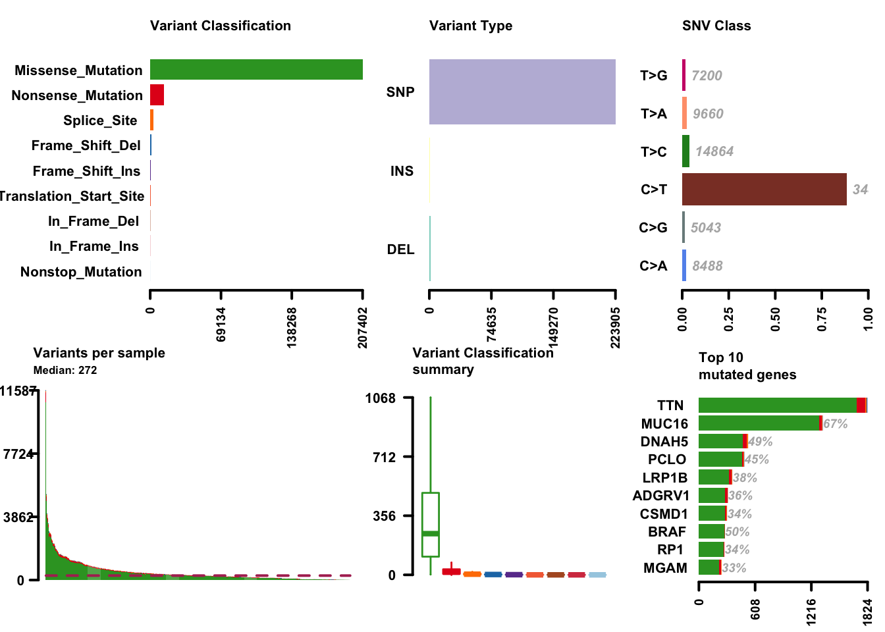
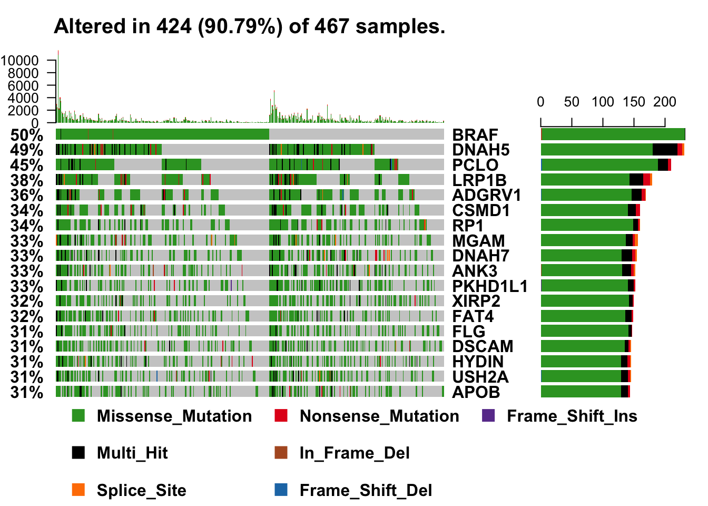

The [NCI Genomic Data Commons (GDC)](https://gdc.cancer.gov) now contains the authoritative source of data from The Cancer Genome Atlas (TCGA) as well as several other projects of import to the cancer research community. One of the available assays produces somatic variant calls, formally identified by comparing tumor reads and normal reads to identify variants relative to the human reference genome that are not present in the normal genome of the patient. Unfortunately, this process for discovering these variants is less precise relative to finding germline variants. Because a gold standard bioinformatics approach for somatic variant calling has not been identified, the GDC runs four separate pipelines and has two levels of data for each. This post demonstrates the use of the Bioconductor [GenomicDataCommons package](https://bioconductor.org/packages/GenomicDataCommons) to identify and then fetch somatic variant results from the NCI GDC and then provide a high-level assessment of those variants using the [maftools package](https://bioconductor.org/packages/maftools). The workflow will be:

1.  Install packages if not already installed
2.  Load libraries
3.  Identify and download somatic variants for a representative TCGA dataset, in this case cutaneous melanoma.
4.  Use maftools to provide rich summaries of the data.

Identifying appropriate resources at the GDC starts with a bit of browsing on the website or with equivalent browsing using one of the GenomicDataCommons introspection functions, `available_fields()` and `available_values()`.

To work through these code examples, the maftools and GenomicDataCommons packages must first be installed.

``` r
source("https://bioconductor.org/biocLite.R")
biocLite(c("GenomicDataCommons", "maftools")
```

Once installed, load the packages, as usual.

``` r
library(GenomicDataCommons)
library(maftools)
```

The data model (how data are described and linked to each other) is quite complicated, but documentation is available. In general, though, linking Bioconductor tools to data involves finding files that meet some criteria. Each file in the GDC is identified by a “UUID” that carries no meaning other than it is unique. TCGA barcodes are not *directly* used for identifying files, though filtering files by TCGA barcodes is possible (and not shown here). So, the first step is to find barcodes associated with a \[MAF format file\] for TCGA project “TCGA-SKCM”. Searching based on `data_type`, `data_format`, and `analysis.workflow_type` will limit results to the file of interest, namely the [MuTect2 workflow](https://docs.gdc.cancer.gov/Data_Dictionary/viewer/#?view=table-definition-view&id=somatic_aggregation_workflow&_top=1) variant calls, converted to MAF format.

``` r
uuids = files() %>% 
    GenomicDataCommons::filter(~ cases.project.project_id=='TCGA-SKCM' & 
        data_type=='Masked Somatic Mutation' &
        data_format=='MAF' &
        analysis.workflow_type=='MuTect2 Variant Aggregation and Masking') %>%
    ids()
```

Once the uuids have been identified (in this case, only 4b7a5729-b83e-4837-9b61-a6002dce1c0a), the `gdcdata()` function downloads the associated files and returns a filename for each uuid.

``` r
maffile = gdcdata(uuids)
```

The MAF file is now stored locally and the [maftools package](https://bioconductor.org/packages/maftools) workflow, which starts with a MAF file, can proceed, starting with reading the melanoma MAF file.

``` r
melanoma_vars = read.maf(maf = maffile, verbose = FALSE)
```

With the data available as a maftools MAF object, a lot of functionality is available with little code. While the maftools package offers quite a few functions, here are a few highlights. Cancer genomics and bioinformatics researchers will recognize these plots, most likely.

``` r
plotmafSummary(maf = melanoma_vars, rmOutlier = TRUE,
               addStat = 'median', dashboard = TRUE,
               titvRaw = FALSE)
```



``` r
# exclude a couple of "noise" genes--common practice, unfortunately
oncoplot(maf = melanoma_vars, top = 15, fontSize = 12,
         genes = getGeneSummary(melanoma_vars)$Hugo_Symbol[3:20])
```



``` r
braf.lpop = lollipopPlot(maf = melanoma_vars, gene = 'BRAF',
                           AACol = 'HGVSp_Short', showMutationRate = TRUE,
                           domainLabelSize = 3, defaultYaxis = FALSE)
```

Additional functionality is available for both the GenomicDataCommons and maftools packages. This post just highlights how one can leverage two Bioconductor packages to quickly gain insight into public cancer genomics datasets.

# Appendix

Examining available values in the GDC is straightforward, allowing for variations on the workflow above.

## Available data_types:

``` r
available_values('files','data_type')
```

```
##  [1] "Annotated Somatic Mutation"       
##  [2] "Raw Simple Somatic Mutation"      
##  [3] "Aligned Reads"                    
##  [4] "Gene Expression Quantification"   
##  [5] "Slide Image"                      
##  [6] "Biospecimen Supplement"           
##  [7] "Copy Number Segment"              
##  [8] "Masked Copy Number Segment"       
##  [9] "Clinical Supplement"              
## [10] "Methylation Beta Value"           
## [11] "Isoform Expression Quantification"
## [12] "miRNA Expression Quantification"  
## [13] "Raw CGI Variant"                  
## [14] "Aggregated Somatic Mutation"      
## [15] "Masked Somatic Mutation"
```

## Available data_formats:

``` r
available_values('files','data_format')
```

```
##  [1] "VCF"               "TXT"               "BAM"              
##  [4] "SVS"               "BCR XML"           "BCR SSF XML"      
##  [7] "BCR Auxiliary XML" "BCR OMF XML"       "BCR Biotab"       
## [10] "MAF"               "XLSX"
```

## Available analysis workflows:

``` r
available_values('files','analysis.workflow_type')
```

```
##  [1] "DNAcopy"                                      
##  [2] "BCGSC miRNA Profiling"                        
##  [3] "BWA with Mark Duplicates and Cocleaning"      
##  [4] "FM Simple Somatic Mutation"                   
##  [5] "FoundationOne Annotation"                     
##  [6] "Liftover"                                     
##  [7] "STAR 2-Pass"                                  
##  [8] "HTSeq - Counts"                               
##  [9] "HTSeq - FPKM"                                 
## [10] "HTSeq - FPKM-UQ"                              
## [11] "BWA-aln"                                      
## [12] "SomaticSniper"                                
## [13] "SomaticSniper Annotation"                     
## [14] "MuTect2"                                      
## [15] "MuTect2 Annotation"                           
## [16] "VarScan2"                                     
## [17] "VarScan2 Annotation"                          
## [18] "MuSE"                                         
## [19] "MuSE Annotation"                              
## [20] "BWA with Mark Duplicates and BQSR"            
## [21] "BWA with BQSR"                                
## [22] "VCF LiftOver"                                 
## [23] "MuSE Variant Aggregation and Masking"         
## [24] "MuTect2 Variant Aggregation and Masking"      
## [25] "SomaticSniper Variant Aggregation and Masking"
## [26] "VarScan2 Variant Aggregation and Masking"     
## [27] "FoundationOne Variant Aggregation and Masking"
## [28] "_missing"
```
